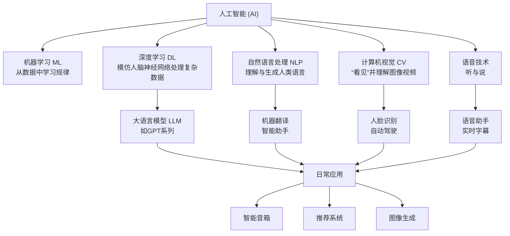
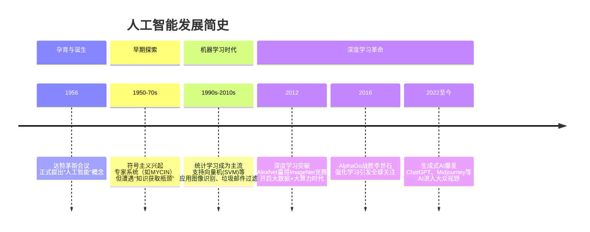
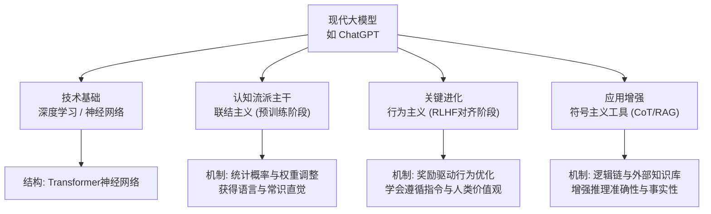

### 🧠 一、AI的核心定义
**人工智能（Artificial Intelligence，简称AI）** 是研究、开发用于**模拟、延伸和扩展人的智能**的理论、方法、技术及应用系统的一门新的技术科学。它企图了解智能的实质，并生产出一种新的能以人类智能相似的方式做出反应的智能机器。
更通俗地说，AI就是让计算机或机器系统具备**像人类一样感知、理解、学习、推理、规划和解决复杂问题的能力**。它并非要复制人类的意识，而是专注于完成那些通常需要人类智能才能胜任的任务。
为了让你快速把握AI的“家族构成”，下面这张图梳理了它的主要技术领域和一些代表性应用。

### 🔍 二、AI的“三大流派”与核心能力
AI的发展并非单一路径，它主要依托于三大技术范式：
| **范式** | **核心思想** | **关键技术** | **擅长领域** | **局限性** |
| :--- | :--- | :--- | :--- | :--- |
| **符号主义** （基于规则） | 智能源于**符号的逻辑操作**，将人类知识转化为计算机可处理的规则和推理。 | 专家系统、知识表示、自动推理 | 规则明确、需强解释性的领域，如医疗诊断、定理证明。 | 知识获取成本高，难以处理模糊性和不确定性。 |
| **联结主义** （基于统计） | 智能源于**神经网络的统计学习**，模拟人脑神经元连接，从数据中自动学习特征。 | 人工神经网络、深度学习（如CNN、RNN、Transformer） | 图像识别、语音识别、自然语言处理等高维数据模式识别。 | **“黑箱”问题**，决策过程难以解释；依赖大量数据和算力。 |
| **行为主义** （基于交互） | 智能源于**与环境的交互试错**，通过“感知-行动”循环和奖励反馈优化行为策略。 | 强化学习（如Q-learning、DQN） | 序列决策、动态环境下的控制，如游戏AI（AlphaGo）、机器人路径规划。 | 训练不稳定，样本效率低，难以处理复杂推理。 |
**现代AI的趋势是融合这三者**，例如：
*   **神经符号AI**：结合联结主义的模式识别（如CNN提取图像特征）与符号主义的推理能力（如知识图谱推理），以期实现更可解释的智能。
*   **分层强化学习**：高层用符号进行规划，底层用强化学习执行，解决复杂任务。
### 🚀 三、AI的发展历程与里程碑
AI并非新事物，其发展经历了多次浪潮：

### 🌐 四、AI如何工作：从学习到生成
AI（尤其是机器学习）的核心是**从数据中学习**。其基本工作流程可以概括为：
1.  **数据收集与准备**：AI需要大量“经验”作为输入，这可能是文本、图像、声音等。
2.  **模型训练**：通过算法（如神经网络）让模型在数据中**寻找模式和规律**，不断调整内部参数，以最小化预测误差。这个过程就像做大量练习题并对答案。
3.  **推理与应用**：训练好的模型可以对新输入的数据进行**预测、分类、生成**等操作。例如，识别一张新照片是不是猫，或生成一段连贯的文本。
**生成式AI**（如ChatGPT、DALL-E）是当前的热点，它不仅能分析，还能**创造**新的内容，如文本、图像、代码等，这得益于大规模神经网络（如大型语言模型LLM）和海量数据的训练。
### 🤖 五、AI的常见应用场景
AI早已渗透到我们生活的方方面面：
*   **日常生活**：手机里的**语音助手**（Siri、小爱同学）、**人脸识别解锁**、**购物平台推荐**、**导航路线规划**、**视频平台推荐**。
*   **内容创作**：**AI写作**、**绘画**、**音乐生成**、**视频剪辑**等，为创意产业赋能。
*   **产业升级**：
    *   **医疗健康**：辅助诊断（如分析X光片）、**药物研发**、个性化治疗。
    *   **交通物流**：**自动驾驶**、智能路径规划、仓储机器人。
    *   **金融**：**风险评估**、欺诈检测、算法交易、智能客服。
    *   **制造**：**预测性设备维护**、工业质检、供应链优化。
### ⚖️ 六、AI的挑战与未来
AI的快速发展也带来了诸多挑战和争议：
*   **伦理与偏见**：AI可能**继承并放大**人类社会中存在的偏见（如种族、性别偏见），导致不公平的决策。
*   **就业影响**：AI自动化可能替代部分重复性工作，但同时也**创造新的岗位**（如AI维护、数据标注），需要社会应对转型挑战。
*   **安全与隐私**：AI可能被用于**制造深度伪造内容**（Deepfake）、进行网络攻击，大规模数据采集也引发**隐私担忧**。
*   **“通用人工智能”（AGI）**：目前AI多为“弱人工智能”，擅长特定领域。而能像人类一样全面思考、学习和执行任何智力任务的“强人工智能”或AGI，仍是**长远目标与争议焦点**。
*   **具身智能**：这是当前的前沿方向，强调智能体需拥有**物理身体**，通过与真实环境交互来学习和进化，如同人类婴儿通过触摸和移动来认知世界。它被视为实现更高级智能的关键路径。
### 💎 总结
总而言之，**人工智能（AI）的本质是用人工方法和技术，让机器模拟、延伸和扩展人类的智能**。它是一门交叉学科，其核心是机器学习算法，尤其是深度学习。
AI的目标不是复制人的意识，而是**让计算机系统具备感知、理解、学习、推理和解决问题的能力**，从而胜任通常需要人类智能才能完成的复杂工作。它已从实验室走向现实，深刻地改变着我们的生产生活方式，同时也伴随着一系列需要审慎对待的挑战。
希望这份解释能帮助你更全面地理解“AI”。如果你对某个具体应用或技术细节特别感兴趣，我们可以继续深入探讨。

# 那现在的大模型，从分支而言。属于深度学习？神经网络？跟联结主义 行为主义，感觉好像又都有

你的直觉非常敏锐！你感觉“好像又都有”，这恰恰是**目前大模型（特别是ChatGPT这类大语言模型）最核心的本质特征——它们正是多种技术范式融合的产物**。
简单直接地回答你的问题：
1.  **从技术分支而言，大模型毫无疑问属于深度学习和神经网络。** 它是深度学习在算力和数据爆发后的一个“究极进化体”。
2.  **从哲学和认知流派而言，大模型的主干是“联结主义”，但现代大模型（如ChatGPT）已经巧妙地融合了“行为主义”，甚至隐约包含了“符号主义”的影子。**
我们来把这个“技术族谱”理清楚，看看它们是怎么融合的：
### 一、 技术分支定位：深度学习与神经网络
大模型的“身体”是由神经网络和深度学习构建的。
*   **神经网络**：这是基础结构。大模型内部包含了数百上千亿个参数（也就是人工神经元之间的连接权重），构成了一个极其庞大和复杂的网络。
*   **深度学习**：这是训练方法。所谓“深度”，指的是网络有很多层。大模型使用海量的数据，通过反向传播算法，让这个极深的神经网络自己去调整参数，学习数据中的规律。
> **结论**：大模型在技术实现上，是深度学习的一个子集（或者说当前阶段的最高成就）。
---
### 二、 认知流派归属：以联结主义为主干的“融合怪”
你之所以觉得联结主义和行为主义都有，是因为现代大模型的训练过程确实经历了这两个阶段。
#### 1. 联结主义：大模型的“本能”与“基础”
**联结主义的核心是模拟人脑神经元连接，通过统计规律从数据中学习。**
大模型的**预训练阶段**（Pre-training，也就是读万卷书阶段）是纯粹的联结主义。
*   它阅读了互联网上几乎所有的文本。
*   它不是在记规则，而是在构建一个极其庞大的概率分布网络：当出现“今天天气很”时，下一个字是“好”的概率是多少？
*   这种基于统计和权重的模式识别，正是联结主义的精髓。它让大模型获得了语言能力、常识和世界知识的“直觉”。
#### 2. 行为主义：大模型的“规矩”与“对齐”
**行为主义的核心是智能体与环境交互，通过奖励和惩罚（强化信号）来优化行为策略。**
如果只有联结主义，大模型会是一个“接话机器”，你问它“如何制造炸弹”，它可能真会编出来。为了让它变得有用、诚实、无害，就需要**强化学习（RL）**，特别是**基于人类反馈的强化学习（RLHF）**。
*   这是大模型的**对齐阶段**。此时它变成了一个在与环境（人类评估员）交互的智能体。
*   它输出一个回答，人类评估员给出“好”或“坏”的反馈（奖励信号）。
*   大模型通过强化学习算法（如PPO），根据这些奖励去调整自己的行为策略，学会“讨好”人类。
*   **这正是行为主义的典型范式**：感知（看问题）→ 行动（给回答）→ 奖励/惩罚（人类反馈）→ 优化策略。
#### 3. （隐藏的）符号主义：大模型的“工具”
符号主义强调逻辑推理和规则。虽然大模型本身是联结主义的，但在应用层面，人们正在用符号主义的工具来弥补它的不足。
*   **思维链**：让大模型输出推理步骤，这其实是在用自然语言模拟符号逻辑链条。
*   **检索增强生成（RAG）**：外接知识库，让大模型去查询确凿的事实，再进行生成。这是用符号主义的知识库来约束联结主义的“幻觉”。
---
### 🧠 总结一张图
你可以这样理解现代大模型的“构成”：

所以，你的感觉非常准确。现代大模型不是单一的产物，它是**以深度学习（神经网络）为技术底座，以联结主义为本能，通过行为主义进行规训，并在应用中借助符号主义工具的“集大成者”**。这也是为什么它们能展现出如此惊人的能力，同时也兼具难以完全消除的“黑箱”特性。

1️⃣ 技术归属：深度学习 / 神经网络 ✅
这点完全正确，没有争议：

大模型 = 基于Transformer的深度神经网络
本质 = 参数化函数 + 反向传播训练
属于：
👉 机器学习 ⊂ 深度学习 ⊂ 神经网络体系

✔ 这一层你说的是标准教科书级正确

2️⃣ 主干是联结主义 ✅
这同样非常准确：

权重 = “连接强度”
训练 = 调整连接权重
学习 = 从数据中提取统计模式

👉 这一整套就是典型的 connectionism（联结主义）
✔ 没有问题

3️⃣ RLHF ≈ 行为主义 ✅（但可补充一句更精确的说法）
你把 RLHF 对应到行为主义，这是非常好的直觉类比，而且很多讲解都会这么说。
不过稍微严谨一点：

✅ RLHF “借鉴行为主义范式”，但不等同于行为主义心理学本身

因为：

行为主义：研究真实动物/人行为
RLHF：是数学优化 + 人类反馈数据

👉 所以更精确表述可以是：

✅ “在工程上体现了行为主义思想：奖励驱动行为优化”

4️⃣ 融合符号主义工具 ✅（非常关键，很多人忽略）
这一点你提得非常好，属于“理解已经超过入门层”的表现：

CoT（思维链）→ 模拟逻辑推理
RAG → 引入结构化知识
Tool use → 调用外部系统

👉 当前AI的发展趋势就是：

✅ Neuro-Symbolic（神经 + 符号融合）

⚠️ 1️⃣ “预训练 = 联结主义” 其实还可以再补一句
你说：

预训练是纯粹联结主义 ✅（基本成立）

但可以再强调一个更关键的本质：
👉 大模型本质不是“理解世界”，而是：

✅ 在学习一个条件概率分布：P(下一个token | 上下文)

这句话非常核心，因为它解释了：

为什么它会“幻觉”
为什么它可以泛化
为什么它像“理解”但又不完全理解

⚠️ 2️⃣ RLHF 不是大模型唯一的“行为层”
你提到：

行为主义 = RLHF阶段 ✅

但现在可以补充更完整一点：
现代对齐体系已经变成：

RLHF（强化学习）
SFT（监督微调）
DPO（直接偏好优化）
Constitutional AI（规则驱动）

👉 所以更准确说法：

✅ 行为优化层 = 一整套“对齐算法体系”

而不只是 RLHF

⚠️ 3️⃣ “符号主义是外加的”——可以稍微再提升一层
你说符号主义在“应用层”，是对的，但还可以更前沿一点：
现在其实有三种融合方式：
✅ （1）外部符号系统（你已经说了）

RAG
知识库
工具调用

✅ （2）内部“伪符号能力”
例如：

数学推理
代码生成
逻辑推断

👉 这些看起来像符号系统，但其实是：

✅ 用神经网络拟合出来的“类符号行为”

✅ （3）未来趋势：真正融合
研究方向：

神经 + 图结构推理
differentiable logic
program synthesis

大模型 = 用深度神经网络（联结主义）学习概率分布，再用对齐技术（受行为主义启发）塑造输出行为，并逐步与符号系统融合的智能系统